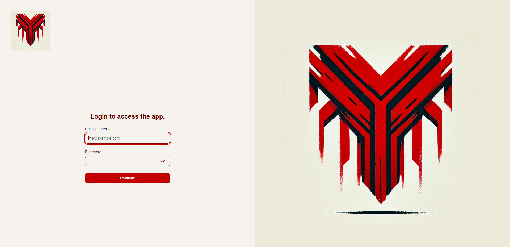
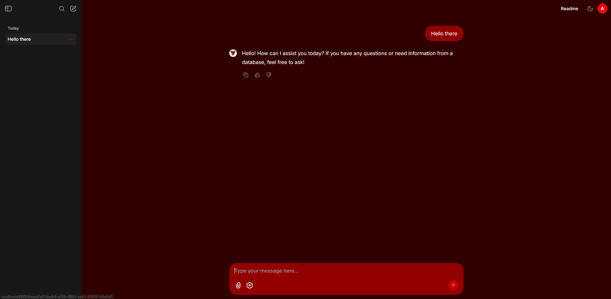
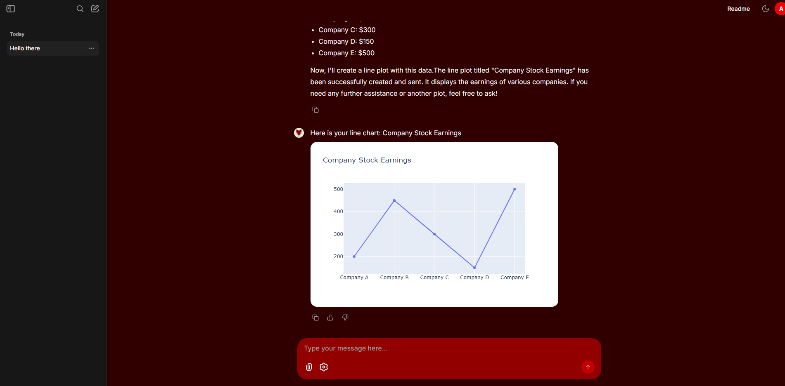
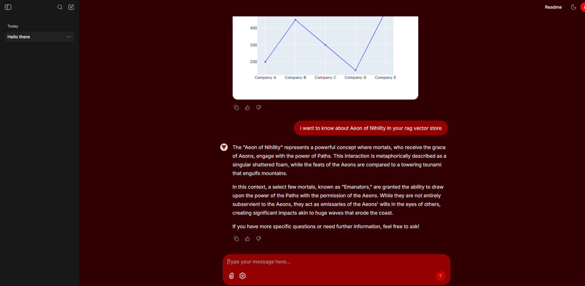

# VEGA AI, Personal RAG and Linux SysAdmin management

## Login

## Hello

## Plot

## RAG

# Installation
# Docker setup
1. Make volume mount for Postgre and Minio, 
    `mkdir volume && cd volume && mkdir postgre minio`
2. Setting up `.env` by copy-ing and changing the value inside the `.env.example`
3. `docker compose up`, you can change the expose port in app service inside `docker-compose.yaml`
4. Go to `localhost:8000`

# Baremetal
1. Prepare Postgre and Minio, and make sure it has required permission.
2. Prefered: Install poetry for python, use this guide https://python-poetry.org/docs/
    Alternative: make python 3.10 venv. and install `pip install requirements.txt` inside `src`.
3. Go to `src` and run `chainlit run app.py --port 8000`
4. Go to `localhost:8000`

